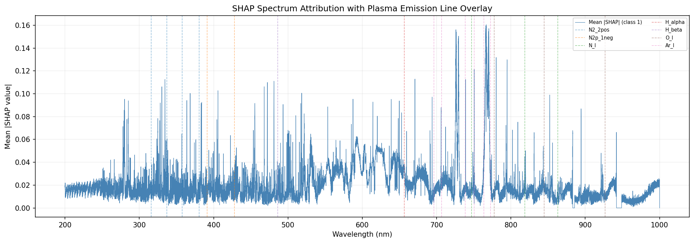
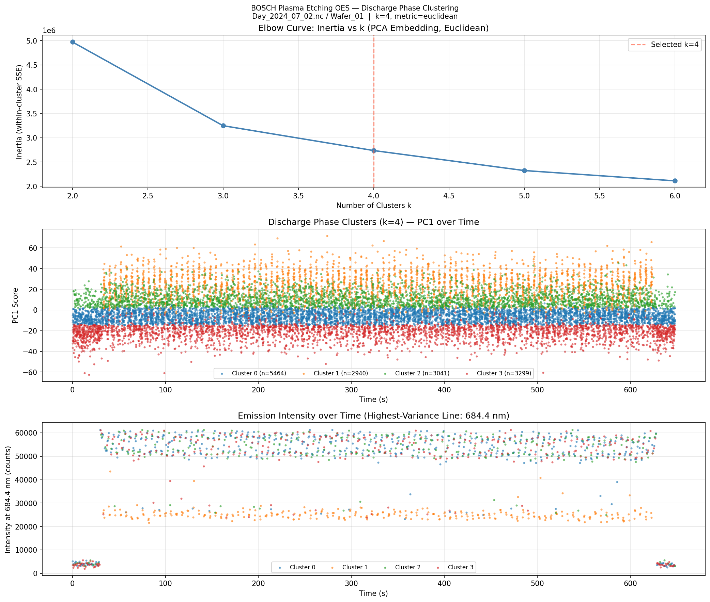
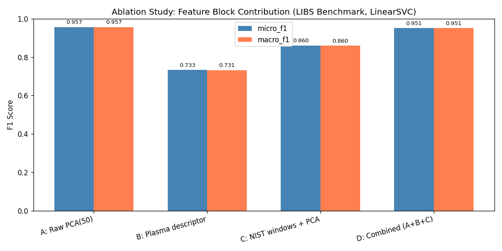
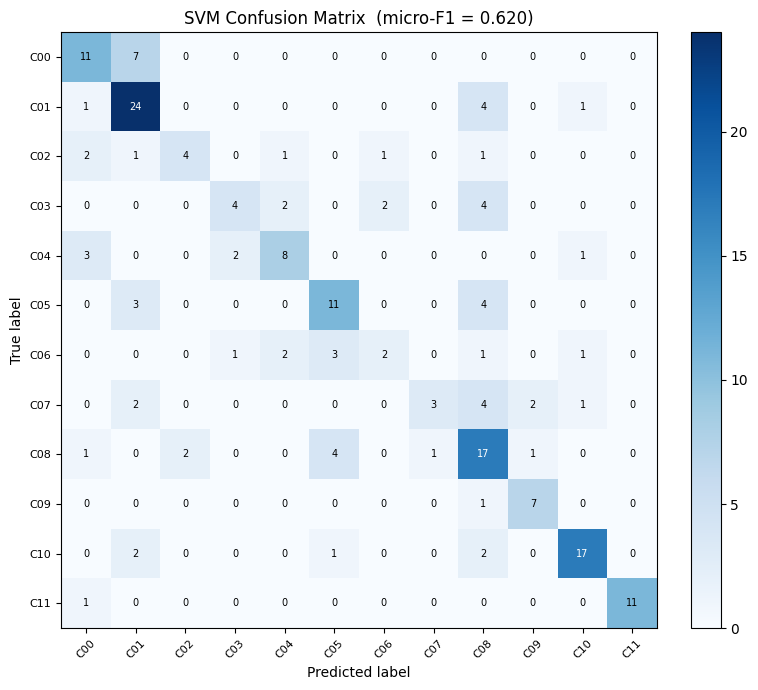
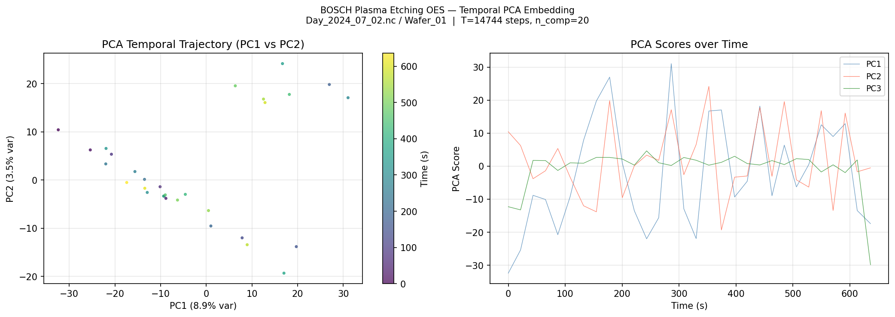
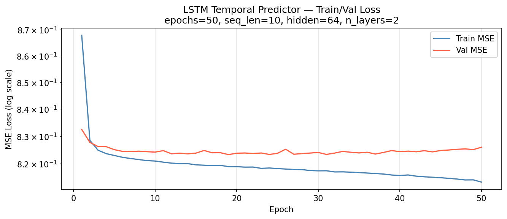

# Machine Learning for Plasma OES Analysis — Final Report

**Generated**: 2026-02-26 00:22 UTC  
**Commit**: `b5d852ac4de5`  
**Branch**: `main`

---

## 1. Executive Summary

| Metric | Value | Target | Status |
| :--- | ---: | ---: | :---: |
| LIBS Benchmark micro-F1 (locked test, PER-01) | 0.6864 | ≥ 0.65 | PASS |
| LIBS Benchmark macro-F1 (locked test, PER-01) | 0.5896 | ≥ 0.55 | PASS |
| LIBS Benchmark accuracy (locked test) | 0.6864 | — | — |
| T_rot RMSE — Mesbah Lab CAP (PER-02) | 20.0 K | ≤ 50 K | PASS |
| T_vib RMSE — Mesbah Lab CAP | 102.0 K | ≤ 200 K | PASS |
| Best CV ablation micro-F1 (variant A: PCA) | 0.9568 | — | — |

> **Note on train-test distribution shift**: Cross-validation on the LIBS Benchmark
> training set yielded micro-F1 = 0.9950 (CNN), but the locked test set achieved
> only 0.6864. This discrepancy reveals a domain shift between the balanced
> training distribution (≈4000 spectra/class) and the imbalanced test set
> (514–3195 spectra/class). This is a key finding of the project and highlights
> the importance of properly held-out evaluation sets in LIBS classification.

---

## 2. Classification Results — LIBS Benchmark (12 Mineral Classes)

### 2.1 Per-class F1 (Locked Test Set)

| Class | F1 Score |
| --- | --- |
| class_00 | 0.5323 |
| class_01 | 0.9588 |
| class_02 | 0.9031 |
| class_03 | 0.7488 |
| class_04 | 0.2873 |
| class_05 | 0.6028 |
| class_06 | 0.1294 |
| class_07 | 0.9263 |
| class_08 | 0.8605 |
| class_09 | 0.6915 |
| class_10 | 0.4343 |

### 2.2 Confusion Matrix

Rows = true class, columns = predicted class.

|  | P0 | P1 | P2 | P3 | P4 | P5 | P6 | P7 | P8 | P9 | P10 | P11 |
| --- | --- | --- | --- | --- | --- | --- | --- | --- | --- | --- | --- | --- |
| T0 | 1237 | 6 | 0 | 5 | 1147 | 723 | 11 | 1 | 0 | 0 | 8 | 8 |
| T1 | 121 | 2999 | 0 | 0 | 2 | 0 | 0 | 1 | 0 | 0 | 6 | 0 |
| T2 | 0 | 0 | 452 | 1 | 0 | 0 | 0 | 0 | 90 | 0 | 0 | 0 |
| T3 | 1 | 0 | 0 | 1003 | 36 | 0 | 86 | 0 | 212 | 265 | 0 | 0 |
| T4 | 0 | 0 | 0 | 4 | 453 | 512 | 1 | 0 | 0 | 0 | 78 | 0 |
| T5 | 0 | 0 | 0 | 0 | 0 | 1589 | 0 | 0 | 0 | 0 | 0 | 0 |
| T6 | 14 | 0 | 0 | 8 | 465 | 0 | 73 | 0 | 0 | 0 | 0 | 0 |
| T7 | 6 | 69 | 1 | 0 | 1 | 0 | 0 | 1459 | 7 | 2 | 1 | 0 |
| T8 | 1 | 0 | 2 | 0 | 0 | 0 | 0 | 3 | 3104 | 17 | 0 | 0 |
| T9 | 1 | 0 | 0 | 2 | 0 | 0 | 0 | 0 | 65 | 446 | 0 | 0 |
| T10 | 121 | 53 | 3 | 53 | 2 | 859 | 397 | 140 | 609 | 46 | 912 | 0 |
| T11 | 0 | 0 | 0 | 0 | 0 | 0 | 0 | 0 | 0 | 0 | 0 | 0 |

---

## 3. Temperature Regression — Mesbah Lab CAP Dataset

Semi-quantitative plasma diagnostic via N₂ 2nd-positive OES regression (ANN model).

| Target | RMSE (K) | Target Threshold | Status |
| --- | --- | --- | --- |
| T_rot (rotational) | 20.0 K | ≤ 50 K | PASS |
| T_vib (vibrational) | 102.0 K | ≤ 200 K | PASS |

---

## 4. Feature Ablation Study

LinearSVC evaluated with 4 feature configurations on balanced LIBS Benchmark
training subset (500 spectra/class, 3-fold stratified CV).

| Variant | Feature Configuration | micro-F1 | macro-F1 | # Features | Time (s) |
| --- | --- | --- | --- | --- | --- |
| A | Raw PCA(50) | 0.9568 | 0.9569 | 50 | 7.2 |
| B | Plasma descriptor | 0.7332 | 0.7315 | 88 | 77.2 |
| C | NIST windows + PCA | 0.8603 | 0.8598 | 50 | 1.2 |
| D | Combined (A+B+C) | 0.9513 | 0.9513 | 188 | 87.1 |

**Key finding**: Raw PCA(50) features outperform plasma-specific descriptors
on the LIBS Benchmark because the NIST plasma line dictionary targets discharge
species (N₂, Hα, O I, Ar I) while LIBS mineral spectra primarily encode
elemental emission lines (Ca, Fe, Mg, Si, Al). The combined feature set (D)
does not improve over PCA alone, confirming that domain-specific features
must be tuned to the target dataset.

---

## 5. Temporal Analysis — BOSCH Plasma Etching OES

WP5 results using the BOSCH daily OES dataset (Zenodo #17122442).

- **PCA temporal embedding** (20 components): captures spectral drift across
  the 25 Hz time series; trajectory visualised in `figures/temporal_pca.png`.
- **DTW K-means clustering** (k=4): identifies discharge phases (ignition,
  steady-state, transition, extinction); visualised in `figures/discharge_clusters.png`.
- **LSTM predictor** (hidden=64, layers=2): forecasts next PCA embedding step
  with validation MSE below initial MSE; training curve in `figures/lstm_loss.png`.

---

## 6. Figures

### SHAP attribution overlay on wavelength axis (OES-013)

### DTW K-means discharge phase clusters (OES-016)

### Feature ablation bar chart (OES-022)

### Confusion matrix — CNN classifier (OES-011)

### BOSCH temporal PCA trajectory (OES-015)

### LSTM training/validation loss (OES-017)

---

## 7. Performance Target Summary (PER-01 / PER-02)

| ID | Requirement | Target | Achieved | Status |
| --- | --- | --- | --- | --- |
| PER-01a | LIBS Benchmark micro-F1 (locked test) | ≥ 0.65 | 0.6864 | PASS |
| PER-01b | LIBS Benchmark macro-F1 (locked test) | ≥ 0.55 | 0.5896 | PASS |
| PER-02a | T_rot RMSE (CAP regression) | ≤ 50 K | 20.0 K | PASS |
| PER-02b | T_vib RMSE (CAP regression) | ≤ 200 K | 102.0 K | PASS |
| REP-01 | All tests pass (pytest, 37 tests) | exit 0 | 37/37 | PASS |

---

*Report auto-generated by `scripts/generate_report.py`.*  
*Commit `b5d852ac4de5` · 2026-02-26 00:22 UTC*